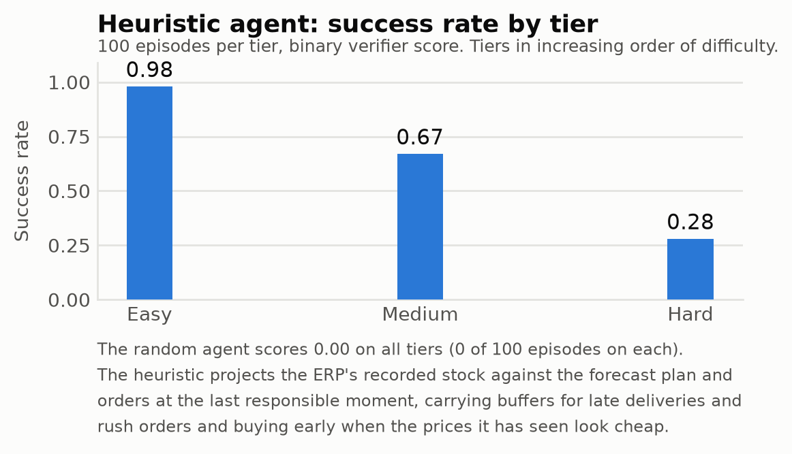

# Manufacturing Replenishing RL Environment

Prompt:
A small plant builds products to a forecast plan. You are the materials planner: order
components so every production run can run in full, the warehouse never overflows and the
budget holds. Success is binary and checked by a verifier that replays your actions against
the hidden true stock.

## Setup

Needs [uv](https://docs.astral.sh/uv/getting-started/installation/), which fetches Python itself.

```bash
uv run mrpenv serve   # play it yourself at http://127.0.0.1:8000
uv run mrpenv run     # watch the heuristic agent play one episode
uv run mrpenv eval    # benchmark every agent, writes benchmark.png
```

## Environment description

**State** (hidden from the agent)

| Field | Meaning |
|---|---|
| `day` | current day, `0 .. H` |
| `true_stock` | what is physically on the shelf |
| `recorded_stock` | what the ERP believes is on the shelf |
| `purchase_orders` | open orders, with their **actual** arrival day |
| `spend` | committed spend so far |
| `scenario` | the disturbance tables: shrinkage, short deliveries, lateness, rush orders, price paths |

**Observation** (what the agent sees — recorded data only)

| Field | Meaning |
|---|---|
| `day`, `horizon`, `done` | the clock |
| `inventory[]` | `sku`, `recorded_on_hand`, `on_order`, `unit_price_today`, `unit_price_change` |
| `open_purchase_orders[]` | `po_id`, `sku`, `qty`, `placed_day`, `promised_arrival` (never the actual one) |
| `production_log[]` | `day`, `product`, `planned` (forecast), `required` (realised), `completed` |
| `spend`, `budget_remaining` | money committed and left |
| `capacity_m3`, `recorded_utilisation` | warehouse size and how full the records say it is |
| `steps_used`, `step_limit`, `last_events` | turn budget and recent events |

Static, fetched once: `horizon`, `capacity_m3`, `budget_eur`, `suppliers` (lead time, lot size,
MOQ, unit cost, unit volume), `bom`, `mps`, `requirements`. The difficulty tier is never shown.

**Actions** — one tool call is one step; reads cost a turn but no money.

| Tool | Args | Effect |
|---|---|---|
| `view_inventory` | – | recorded stock, on-order, open POs, today's quotes |
| `view_plan` | `from_day?`, `to_day?` | forecast plan and derived component requirements |
| `view_master_data` | – | BOM, supplier table, capacity, budget |
| `view_prices` | – | today's quotes plus the history so far |
| `create_purchase_order` | `sku`, `qty` | order placed today, arrives after the lead time |
| `advance_day` | – | receipts, then production consumes its components |

**Reward** — `0` on every step, then at day `H` a single binary score, `1` only if all of:

| Check | Condition |
|---|---|
| integrity | the action ledger's HMAC chain is intact and the reported end state matches the replay |
| complete | the episode covered the whole horizon |
| valid | no tool call was rejected by the ERP |
| service | true stock covered the realised requirement on **every** production day |
| capacity | true end-of-day volume never exceeded the warehouse |
| budget | total spend stayed within budget |

**Initial state distribution** — every scenario is drawn from its seed and then rejection-sampled
against a clairvoyant planner, so warehouse capacity and budget are derived from that plan's own
trajectory and every emitted instance is provably solvable.

**Tiering** — three tiers (`easy`, `medium`, `hard`) raise the number of products, the horizon and
the disturbances together, giving a curriculum from a clean single line to a noisy ERP with a
volatile market.

## Benchmark


